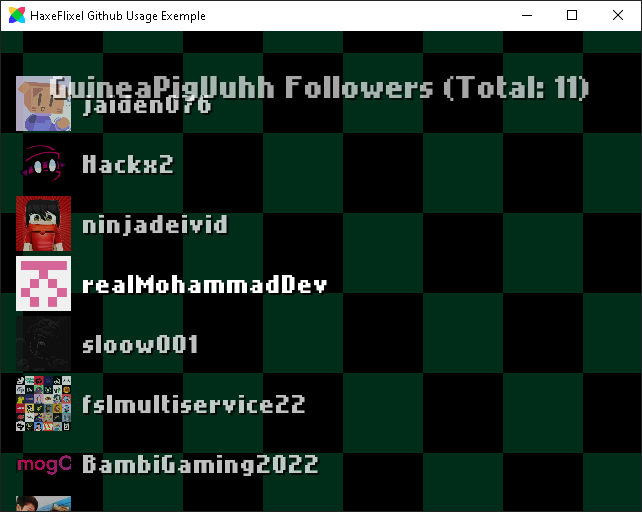

# HaxeFlixel-Github-Exemple
 an example of how to use the haxe-github lib in haxeflixel
 


### Compile
Libraries Requireds
1. [Flixel and Flixel-Addons](https://haxeflixel.com/documentation/install-haxeflixel/)
2. [Haxe-Github](https://github.com/GuineaPigUuhh/haxe-github)

run this code in cmd to Compile
```bash
lime build windows
```